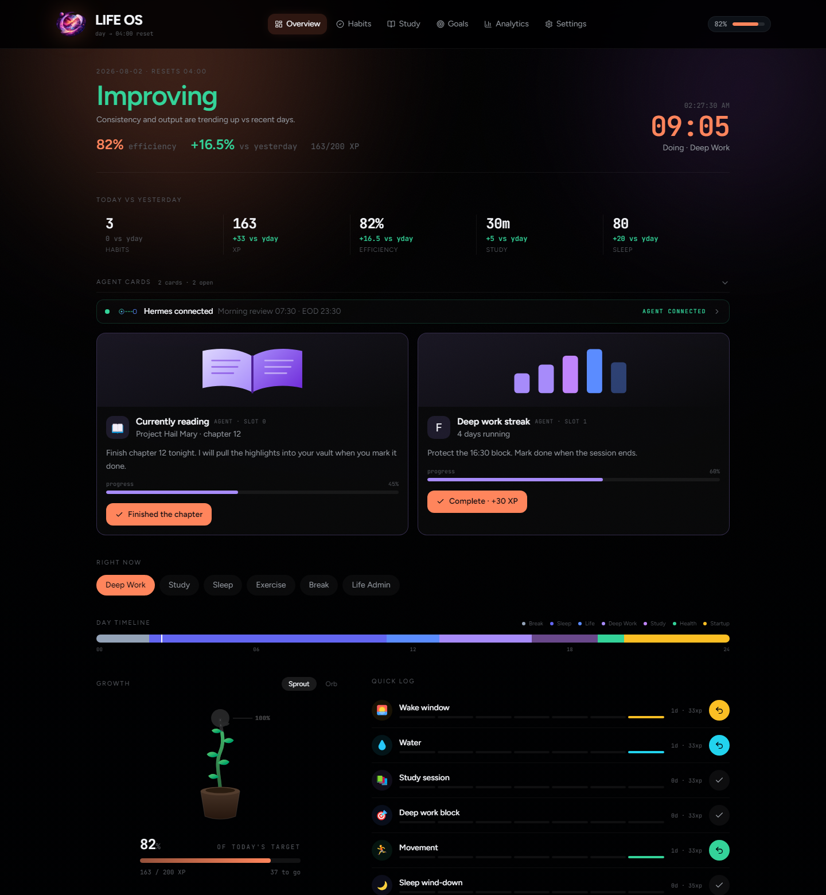
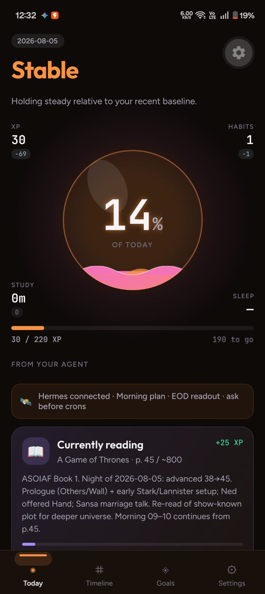
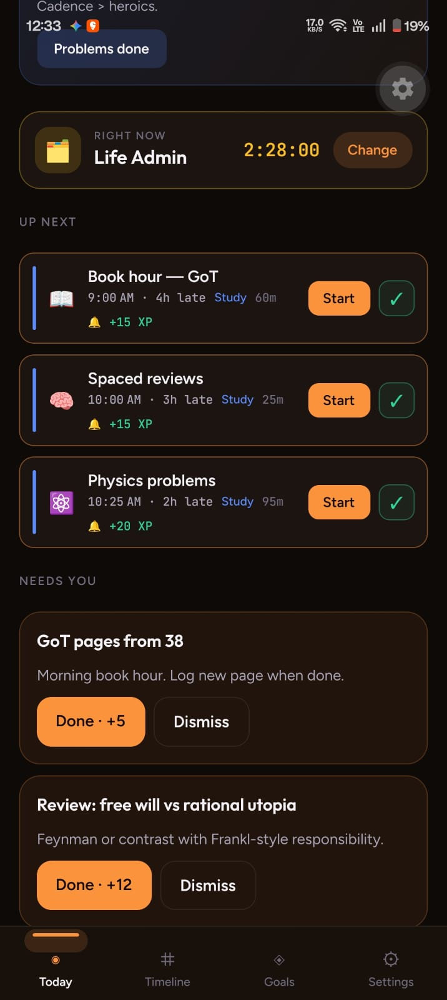
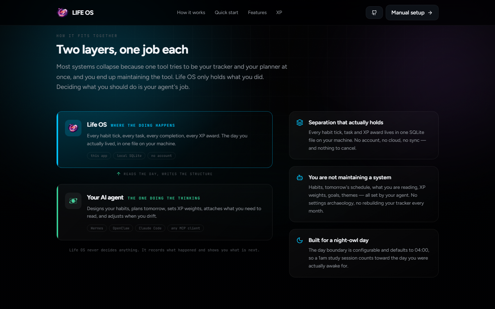
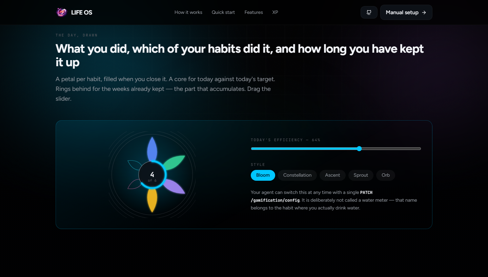
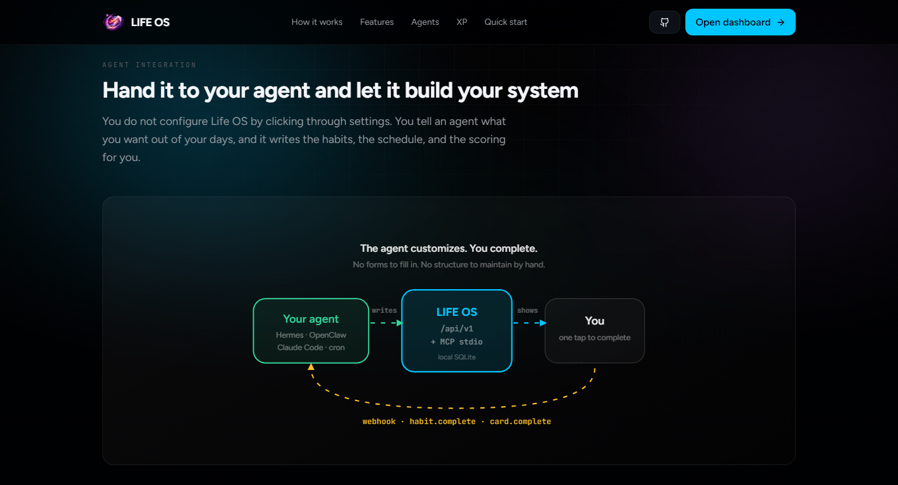

<div align="center">


# Life OS

### An ADHD life manager your AI agent runs for you

Habits, study sessions, sleep, and self-improvement — tracked in one place,
while your AI agent designs the system and keeps it up to date.

**You just tap to complete.**

<br />

[**🌐 See the site**](https://entangledquantum.github.io/Life_OS/) &nbsp;·&nbsp;
[**🚀 Quick start**](#-get-it-running) &nbsp;·&nbsp;
[**🤖 Give it to your agent**](#-give-it-to-your-agent) &nbsp;·&nbsp;
[**📖 Docs**](#-documentation)

<br />


<sub>Node 22.5+ · React 19 · Hono · SQLite · MIT licensed</sub>

</div>

<br />



<br />

<p align="center">
  <strong>📱 Mobile beta is ready</strong> — Android (and soon iOS) will ship shortly.
</p>

<p align="center">
  
  &nbsp;&nbsp;
  
</p>

<br />

## 🧠 The idea

Habit apps ask you to be your own systems designer. Pick the right habits.
Decide what they're worth. Notice when they stop fitting. Rebuild the whole
thing when life changes.

**That's the part that fails first** — not the doing, the *maintaining*.

So Life OS splits the two jobs apart:

<table>
<tr>
<td width="50%" valign="top">

### 🙋 You do the doing

Tap to complete. Start a timer. Say how it went.

That's the entire interaction. No forms, no configuration screens,
no monthly rebuild of your tracker.

</td>
<td width="50%" valign="top">

### 🤖 Your agent does the designing

It creates your habits, plans your day, decides what things are worth,
drops in reviews, and adapts when you drift.

Hermes, OpenClaw, Claude Code — anything that can call an API.

</td>
</tr>
</table>

Everything runs on your own machine, in a single file. No account, no cloud,
no subscription, nothing watching you.

> **What it tracks:** habits · study and learning sessions · sleep rhythm ·
> your daily schedule · goals · any self-improvement you want measured honestly.
>
> **What it refuses to do:** levels, ranks, leaderboards, streak shaming, or
> anyone else's numbers. The only comparison is **you versus yesterday**.

<br />

## 🧩 How it fits together



| Layer | Owns | Never does |
|:--|:--|:--|
| 🔮 **Obsidian vault** | Notes, knowledge, moments worth keeping forever | Track your habits |
| 🎯 **Life OS** *(this app)* | Every habit tick, timer, schedule block, and XP award | Write to your vault |
| 🤖 **Your AI agent** | Designs habits, plans the day, sets XP weights, reviews progress | Do the habits for you |

Your notes never fill up with `drank water ✓`. Your agent reads Life OS and
escalates only what's genuinely worth keeping into Obsidian.

<br />

## ✨ What's in it

<table>
<tr>
<td width="33%" valign="top">

**🎯 One-tap complete**

Tap, get XP, undo if you misfired. Streaks are forgiving — your history is
preserved, never punished.

</td>
<td width="33%" valign="top">

**📊 You vs yesterday**

Efficiency and improvement in plain percentage points. Nobody else on the
screen, ever.

</td>
<td width="33%" valign="top">

**🌱 A growth meter**

Daily progress as a sprout that grows or an orb that fills — with the 100%
state ghosted behind it.

</td>
</tr>
<tr>
<td valign="top">

**📅 A continuous day**

Your agent lays out the day as coloured blocks, midnight to midnight, with no
dead gaps.

</td>
<td valign="top">

**⚡ Quick log**

Agent reviews and tasks sit on top and pulse until done. Habits step aside —
one decision at a time.

</td>
<td valign="top">

**🌙 Night-owl day**

The day boundary defaults to `04:00`, so a 1am session counts toward the day
you were actually awake for.

</td>
</tr>
<tr>
<td valign="top">

**⏱ Real elapsed time**

Start a study block, finish it, and the *actual* duration is logged — not the
time you planned.

</td>
<td valign="top">

**🃏 Agent cards**

Two front-page cards plus a status strip, all agent-controlled, with inline
SVG artwork support.

</td>
<td valign="top">

**🔌 HTTP + MCP**

Full control from any agent, either way. Webhooks tell your agent the moment
you complete something.

</td>
</tr>
<tr>
<td valign="top">

**🔔 Reminders that land**

Your agent schedules something and a nudge before it. Six chimes to pick from,
plus do-not-disturb when you need the room quiet.

</td>
<td valign="top">

**📆 A real timeline**

Everything scheduled lives on its own tab. The dashboard only shows the next
fifteen minutes, so it stays a dashboard.

</td>
<td valign="top">

**🔁 Spaced repetition**

Mark a review done and the next one lands further out — 1 day, 3, 7, 14, 30.
Built in, not bolted on.

</td>
</tr>
<tr>
<td valign="top">

**🏆 Goals you didn't have to invent**

Your agent sets them and writes the finish condition. It's checked after every
change, and celebrated the moment you next look.

</td>
<td valign="top">

**💾 Backs itself up**

A consistent snapshot every few hours, pruned automatically. Your data is one
file and it keeps copies.

</td>
<td valign="top">

**📱 Works on your phone**

Flip one line in `.env` and the whole thing is reachable from anything on your
Wi-Fi.

</td>
</tr>
</table>



<br />

## 🚀 Get it running

You'll need [Node.js 22.5+](https://nodejs.org) and [pnpm](https://pnpm.io).

```bash
git clone https://github.com/EntangledQuantum/Life_OS.git Life_OS
cd Life_OS
pnpm setup
pnpm dev
```

Then open **http://127.0.0.1:5173**. That's it.

`pnpm setup` writes your `.env`, installs dependencies, creates the database,
runs migrations, and seeds some starter habits. It's safe to re-run — it will
never overwrite an existing `.env` or touch data you already have.

<table>
<tr><td>App</td><td><code>http://127.0.0.1:5173</code></td></tr>
<tr><td>API</td><td><code>http://127.0.0.1:8787</code></td></tr>
<tr><td>Database</td><td><code>data/lifeos.db</code></td></tr>
<tr><td>Sign-in</td><td>Your <code>API_TOKEN</code> — see below</td></tr>
</table>

> **🔑 One token, no passwords.**
>
> Life OS is single-user and self-hosted, so there are no accounts. The single
> credential is `API_TOKEN` in your `.env`, and every client uses it — the
> browser asks once and remembers, your agent sends it as a bearer header, and
> so will a phone.
>
> **Change it from the default**, especially before opening the API to your
> network. Anything long and random will do:
>
> ```bash
> node -e "console.log(crypto.randomUUID())"
> ```
>
> Multi-user accounts are **on hold** until the single-user experience is
> finished. For remote access, use a VPN rather than port-forwarding — see
> [`docs/NETWORK.md`](docs/NETWORK.md).

<br />

## 🤖 Give it to your agent

This is the part that makes Life OS different. Copy this into Hermes, OpenClaw,
Claude Code, or anything that can run a shell and call an API:

```text
Set up Life OS for me and then run my day with it.

1. Check whether it is already running:
     curl -s http://127.0.0.1:8787/health

2. If nothing answers, ask me where to put it, then:
     git clone https://github.com/EntangledQuantum/Life_OS.git Life_OS
     cd Life_OS
     pnpm setup
     pnpm dev

   Needs Node 22.5+ and pnpm. Do not clone or install until I say yes.

3. Read the skill so you know the whole API:
     docs/skills/life-os/SKILL.md

4. Authenticate with the API_TOKEN from my .env, on every request:
     Authorization: Bearer <API_TOKEN>

   There is no username/password login; POST /api/v1/auth/login returns 410.
   Never print the token back to me or write it into a file you commit.

5. Learn the XP rules before changing anything:
     GET /api/v1/agent/xp-model

6. Then, from now on:
   - ask me what I want to build into my days, and create those habits
   - block out my day on the timeline each morning
   - put what I am reading or working on into a front-page card
   - inject reviews and tasks into my Quick log
   - each night, read GET /api/v1/dashboard/today and tell me how the day went

If you are Hermes:
  load docs/skills/life-os/SKILL.md as a skill, then ask me before creating
  any scheduled morning/end-of-day jobs.

If you are OpenClaw:
  copy docs/skills/life-os/ into your workspace skills/ root, then invoke it
  with /skill life-os.

If you are Claude Code:
  claude mcp add life-os -- pnpm --filter @life-os/mcp start
  or just use the HTTP API above.

Rules: never write to my Obsidian vault from the app. Never add levels or
compare me to anyone. Ask before installing anything.
```



Everything an agent needs lives in one file:
**[`docs/skills/life-os/SKILL.md`](docs/skills/life-os/SKILL.md)**.

**Agents can control:** habits and their weights · the day timeline · study
blocks · front-page cards (including custom SVG artwork) · quests and reviews ·
the daily XP pool · themes · the day reset time · webhooks.

```bash
# Read the entire day in one call
curl -s http://127.0.0.1:8787/api/v1/dashboard/today \
  -H "Authorization: Bearer $LIFEOS_API_TOKEN"
```

Full reference in [`docs/API.md`](docs/API.md). Prefer MCP? `pnpm mcp` exposes
30 tools over stdio.

<br />

## 🎯 How XP works

Most habit apps let your daily score balloon as you add habits, so hitting
"100%" stops meaning anything. Life OS **fixes the pool** and divides it up:

```
dailyXpTarget — 200 by default
      │
      ├── split across your active habits by weight  →  each habit's baseXp
      │
      └── bonuses from cards, tasks, and quests      →  awarded on top
```

Add a sixth habit and the same 200 XP is re-sliced six ways. The pool only
grows when your agent deliberately grows it.

```
efficiency   =  today's XP  ÷  today's target
improvement  =  today's efficiency  −  yesterday's efficiency
```

**No levels. No ranks. Nobody else in the maths.**

Agents discover all of this at runtime via `GET /api/v1/agent/xp-model`.

<br />

## 💾 Your data

One SQLite file at `data/lifeos.db`. Created on first run, survives restarts and
`git pull`, and gitignored — so pushing the repo never pushes your life.

**It backs itself up.** Every 6 hours (configurable in Settings) it writes a
consistent snapshot to `data/backups/`, keeping the last 24 and pruning the rest.
Restoring is a file copy.

```bash
# Take one right now
curl -s -X POST http://127.0.0.1:8787/api/v1/backups \
  -H "Authorization: Bearer $LIFEOS_API_TOKEN"

# Or export the lot as JSON
curl -s http://127.0.0.1:8787/api/v1/export/json \
  -H "Authorization: Bearer $LIFEOS_API_TOKEN" > lifeos-export.json
```

Details in [`docs/DATABASE.md`](docs/DATABASE.md).

<br />

## 🛠 Commands

| Command | What it does |
|:--|:--|
| `pnpm setup` | One-shot install: `.env`, deps, database, migrations, seed |
| `pnpm dev` | Run the API and the app together |
| `pnpm dev:api` · `pnpm dev:web` | Run one side only |
| `pnpm mcp` | Start the MCP server (stdio) for Hermes / Claude / Cursor |
| `pnpm db:migrate` · `pnpm db:seed` | Database maintenance |
| `pnpm db:studio` | Browse your data in Drizzle Studio |
| `pnpm typecheck` | Typecheck every package |
| `pnpm build:pages` · `pnpm preview:pages` | Build and preview the public site |
| `pnpm screenshots` | Regenerate the images in this README |

<br />

## 🧱 Under the hood

| Piece | Choice |
|:--|:--|
| App | Vite · React 19 · Tailwind v4 · Figtree · JetBrains Mono |
| API | Hono · Zod · TypeScript |
| Database | Drizzle ORM · SQLite via Node's built-in `node:sqlite` |
| Agents | REST `/api/v1` · MCP stdio |

```
apps/web/          React app — landing page + dashboard
apps/api/          Hono API + domain services
packages/db/       Schema, migrations, seed, SQLite client
packages/shared/   Types, Zod schemas, XP maths
packages/mcp/      MCP stdio server
docs/              Agent skill, API, database docs, screenshots
data/              Your SQLite database (gitignored)
```

<br />

## 📖 Documentation

| Doc | Who it's for |
|:--|:--|
| [`docs/skills/life-os/SKILL.md`](docs/skills/life-os/SKILL.md) | **Agents** — the only file they need |
| [`docs/API.md`](docs/API.md) | The full HTTP surface |
| [`docs/DATABASE.md`](docs/DATABASE.md) | Where your data lives, how to back it up |
| [`docs/NETWORK.md`](docs/NETWORK.md) | Opening it up to your phone, and what that exposes |
| [`mobile-frontend/`](mobile-frontend/) | **Building another client** — the Android/iOS brief and the isolation rules |
| [`docs/development_log.md`](docs/development_log.md) | **Contributors** — what was built and why |
| [`docs/LIFE_OS.md`](docs/LIFE_OS.md) | The original product spec |

<br />

## 🚧 Where it's at

**Working now** — habits, study blocks, the day timeline, scheduled cards with
reminders and spaced repetition, agent-set goals with auto-checked conditions,
agent-defined counters, analytics, settings, agent cards, webhooks, automatic
database backups, the full HTTP API, and the MCP server.

**Not yet**

- [ ] Multi-user accounts and real authentication — *on hold, single-user for now*
- [ ] Optional hosted Postgres storage — *scaffolded, not wired up*
- [x] Native mobile client (Android beta) — *Expo app in [`mobile-frontend/app/`](mobile-frontend/app/); public release soon*
- [ ] Automated tests

<br />

## 📄 License

MIT — do what you like with it.

<div align="center">
<br />
<sub>Built for a brain that does the work but hates maintaining the system.</sub>
</div>
